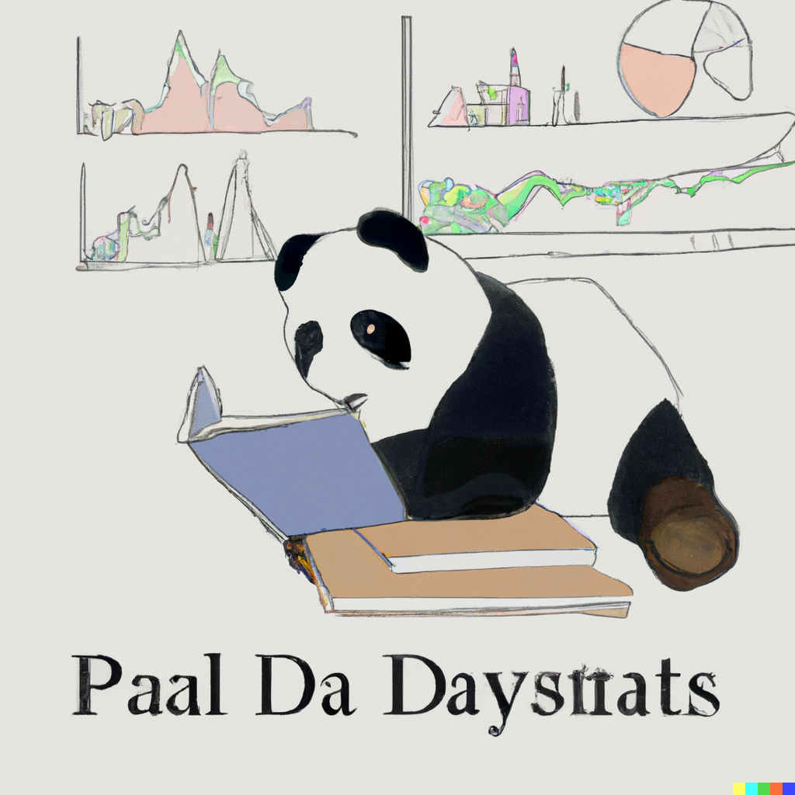

# Project 1: Extract, Transform and Load (ETL)

This is my first project of the Ironhack data analysis bootcamp and it is focused on the analysis of the evolution of prices in a supermarket. To do this, I have started from a historical record of product data between the dates of and I have fed this record with the data of the products that are currently in the supermarket, which I have obtained from scraping their website. Subsequently, both the initial data and the extracted data have been cleaned to achieve a link between them and to be able to generate a MySQL database. Finally, a brief analysis has been carried out based on different data visualization methods from which a set of conclusions have been obtained.  

The supermarket chosen for this project has been DIA, although in the future I hope to expand the development to include other supermarkets. Distribuidora Internacional de Alimentación, S.A. (DIA) is a Spanish multinational hard-discount supermarket chain founded in 1979. DIA is the largest franchiser company in Spain and the fourth largest food sector franchiser in Europe.

## Challenge 1: Extract

The first challenge is to obtain a data set to enrich the starting data. For this, I have used web scraping tools to obtain the information of the products that are currently available in the supermarket. Specifically, I have used Selenium to obtain the URLs of all the product pages that are within each of the supermarket categories. Then, I used BeautifulSoup to parse the HTML information from the scraped URLs and store the useful data such as the product name, the category it belongs to, and its price.

## Challenge 2: Exploratory Data Analysis (EDA)

This second challenge consists of carrying out an exploratory analysis of the data. In my case, I have focused on cleaning the data from the initial csv and the data from the csv that I have obtained after scraping, in order to connect both tables. For which, first of all, I do a little cleanup of both csvs in which I remove the 'description' column because all its values are null, I remove the 'product_id' column because I haven't been able to get all the IDs from the scraping, I remove the 'subcategory' column because it is not included in the initial csv, I match the format of the data insertion dates, I modify the units by substituting their name for their acronym (kilo: kg) and I add the URL column to the scraped csv empty since it depends on the product IDs.

After this, comes the most complicated part of the project, which consists of finding a relationship between the initial data and the scraped data. After analyzing the information contained in each column, I decide to join the data through the 'category' column. The categories used in both data sets are similar, but have different names. To find the equivalence between the names of the categories I use FuzzyWuzzy. After many unsuccessful attempts, I believe that the best way to apply FuzzyWuzzy is to make a 1:1 relationship between keywords in each category. That is why, I clean both columns to be left with only one keyword that describes the category, I apply FuzzyWuzzy between these words and I am left with the result that reaches the highest ratio value. Once I have established the relationship between the categories of both sets, I have to undo the process and go from the keyword of each category to the original name of the category. After this process, the result is the data shown below:

Initial data:

| id      | url                                                                                 | supermarket | category                      | name                                              | price | reference_price | reference_unit | insert_date |
|---------|-------------------------------------------------------------------------------------|-------------|-------------------------------|---------------------------------------------------|-------|-----------------|----------------|-------------|
| 978408  | [https://www.dia.es/compra-online/despensa/desa...](https://www.dia.es/compra-onl... | dia-es      | azucar_chocolates_y_caramelos | NESTLE Caja roja bombones caja 200 gr              | 4.95  | 24.75           | kg             | 2021-08-17  |
| 1500705 | [https://www.dia.es/compra-online/cuidado-del-h...](https://www.dia.es/compra-onl... | dia-es      | perfumeria_higiene_salud     | CISNE mopa microfibra recambio 1 ud                | 4.39  | 4.39            | ud             | 2021-11-21  |
| 2879450 | [https://www.dia.es/compra-online/bebidas/bebid...](https://www.dia.es/compra-onl... | dia-es      | mascotas                      | DIA bebida refrescante aromatizada cítrico zero 0.97 l | 0.97  | 0.65            | l              | 2022-07-18  |
| 657687  | [https://www.dia.es/compra-online/despensa/arro...](https://www.dia.es/compra-onl... | dia-es      | arroz_pastas_y_legumbres     | LUENGO alubia cocida frasco 400 gr                | 0.95  | 2.38            | kg             | 2021-06-21  |
| 678716  | [https://www.dia.es/compra-online/cuidado-perso...](https://www.dia.es/compra-onl... | dia-es      | perfumeria_higiene_salud     | COLORCREM tinte Violín Nº 46 caja 1 ud            | 4.25  | 4.25            | ud             | 2021-06-25  |

Scraped data:

| id   | url | supermarket | category                     | name                                                  | price | reference_price | reference_unit | insert_date |
|------|-----|-------------|------------------------------|-------------------------------------------------------|-------|-----------------|----------------|-------------|
| 2401 | NaN | dia-es      | azucar_chocolates_y_caramelos | Golosinas sour boom mix FINI BOLSA 165 GR             | 2.25  | 13.64           | kg             | 2023-07-10  |
| 5110 | NaN | dia-es      | perfumeria_higiene_salud     | Desodorante antitranspirante efecto invisible ...     | 2.55  | 1.28            | NaN            | 2023-07-10  |
| 4526 | NaN | dia-es      | limpieza_y_hogar             | Estropajo salvauñas limpieza delicada SUPER PA...     | 0.99  | 0.33            | ud             | 2023-07-10  |
| 815  | NaN | dia-es      | yogures_y_postres            | Yogur desnatado sabor limón VITALINEA 4 unida...     | 1.89  | 3.78            | kg             | 2023-07-10  |
| 3784 | NaN | dia-es      | agua_refrescos_y_zumos       | Bebida de frutas con leche tropical ZUMOSFERA ...     | 1.25  | 1.04            | l              | 2023-07-10  |

The id that appears in both tables corresponds to the pandas id and has no relation to the product id.

## Challenge 3: Data Pipeline

The third challenge is to create a python pipeline that contains all those pieces of code that are used repeatedly in the project and that are likely to be converted into a function.

## Challenge 4: Load

## Visualization and conclusions

## Bonus

### Tools

- [Selenium](https://www.selenium.dev/)
- [BeautifulSoup](https://pypi.org/project/beautifulsoup4/)
- [Pandas](https://pandas.pydata.org/)
- [FuzzyWuzzy](https://pypi.org/project/fuzzywuzzy/)
- 

### Drawbacks and future roadmap

- During Challenge 1: Extract I have encountered the problem of not being able to obtain all the IDs of the products. BeautifulSoup is not able to get the ID of those products that are on sale, even though the HTML tag is the same for all products.

### Special thanks

### Copyright
All the images that appear in this document (with the exception of the graphics that I have generated for the conclusions section) have been created with DALL·E 2.